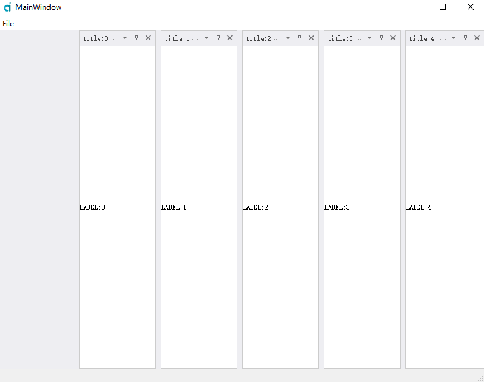
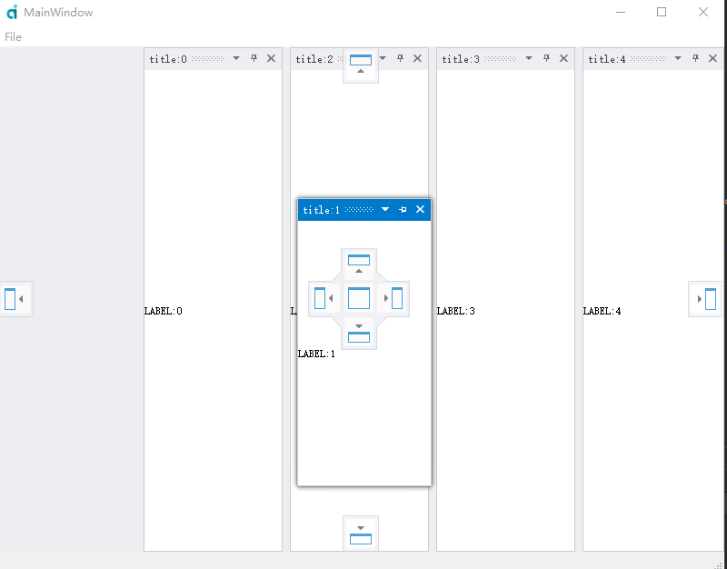

# dockingpane
qt vs like docking pane
visual studio dock panel

## demo

.h
```
#ifndef DOCKWINDOW_H
#define DOCKWINDOW_H
#include "global.h"
#include <QMainWindow>
QT_BEGIN_NAMESPACE
namespace Ui {
class DockWindow;
}
QT_END_NAMESPACE


namespace ady{
    class DockingPaneManager;

    class ANYENGINE_EXPORT DockWindow : public QMainWindow
    {
        Q_OBJECT

    public:
        explicit DockWindow(QWidget *parent = nullptr);
        ~DockWindow();

    public slots:
        void onShow();

    private:
        Ui::DockWindow *ui;
        DockingPaneManager* m_dockingPaneManager;
    };
}


#endif // DOCKWINDOW_H

```


.cpp

```
#include "dockwindow.h"
#include "ui_dockwindow.h"
#include <QMenu>
#include <QMenuBar>
#include <QLabel>
#include <QRandomGenerator>
#include <QApplication>
#include "docking_pane_manager.h"
#include "docking_workbench.h"
#include <QDebug>
#include <QLabel>
namespace ady{

    DockWindow::DockWindow(QWidget *parent) :
        QMainWindow(parent),
        ui(new Ui::DockWindow)
    {
        ui->setupUi(this);
        m_dockingPaneManager = new DockingPaneManager(this);
        this->setCentralWidget(m_dockingPaneManager->widget());
        QString group="label";
        for(int i=0;i<6;i++){
            QLabel* label = new QLabel(QString("LABEL:%1").arg(i),(QWidget* )m_dockingPaneManager->workbench());
            //label->setMinimumSize(QSize(400,400));
            QString id = QString("id:%1").arg(i);
            m_dockingPaneManager->createPane(id,group,QString("title:%1").arg(i),label,i==0?DockingPaneManager::Center:DockingPaneManager::Left);
        }
        QLabel* label = new QLabel(QString("Fixed Window"),(QWidget* )m_dockingPaneManager->workbench());
        m_dockingPaneManager->createFixedPane("11","fix","Fixed Window",label,DockingPaneManager::S_Left);
        connect(m_dockingPaneManager->workbench(),&DockingWorkbench::onShow,this,&DockWindow::onShow);
    }

    void DockWindow::onShow(){
        QLabel* label2 = new QLabel(QString("Float Window"),(QWidget* )m_dockingPaneManager->workbench());
        m_dockingPaneManager->createFloatPane("22","float","Float Window",label2);
    }

    DockWindow::~DockWindow()
    {
        delete ui;
    }


}

```


## screens

  
